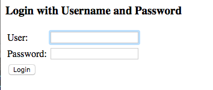

# Premiers pas

## Maven

* Ajouter la dépendance vers `spring-boot-starter-security` :

```xml
<dependency>
     <groupId>org.springframework.boot</groupId>
     <artifactId>spring-boot-starter-security</artifactId>
 </dependency>
```

## Configuration de Spring Security

* Ajouter la classe de configuration _dev.config.WebSecurityConfig_ :

```java
package dev.config;

import org.springframework.context.annotation.Configuration;
import org.springframework.security.config.annotation.authentication.builders.AuthenticationManagerBuilder;
import org.springframework.security.config.annotation.web.builders.HttpSecurity;
import org.springframework.security.config.annotation.web.configuration.EnableWebSecurity;
import org.springframework.security.config.annotation.web.configuration.WebSecurityConfigurerAdapter;

@Configuration
public class WebSecurityConfig extends WebSecurityConfigurerAdapter {

	// Configuration de la source d'identité
    @Bean
    @Override
    public UserDetailsService userDetailsService() {
        // Ici une gestion en "mémoire" des utisateurs
        InMemoryUserDetailsManager manager = new InMemoryUserDetailsManager();
        
        // Création d'un utilisateur en "dur"
        manager.createUser(
                User.withDefaultPasswordEncoder().username("user").password("password").roles("USER").build());
        return manager;
    }

	@Override
	protected void configure(HttpSecurity http) throws Exception {
		http
		// toutes les requêtes HTTP sont soumises à authentification
		.authorizeRequests().anyRequest().authenticated()
		.and()
		// génération de la page de login par Spring Security (pas très jolie mais ça marche)
		.formLogin()
		// la page de login n'est pas soumise à authentification
		.permitAll();
	}

}
```

* Redémarrer l'application et chercher à accéder à une page existante. Vous devriez avoir l'écran d'authentification suivant :



* Connectez-vous et vérifier que l'application fonctionne.

> Tomcat sérialise les sessions sur le disque.
Ce qui veut dire que votre cookie JSESSIONID peut encore être valable après un rédémarrage.
Ce qui a comme conséquence de NE pas vous déconnecter.
Deux options pour se retrouver à l'état déconnecté : lancer une nouvelle navigation privée avec votre navigateur ou supprimer le cookie JSESSIONID.
